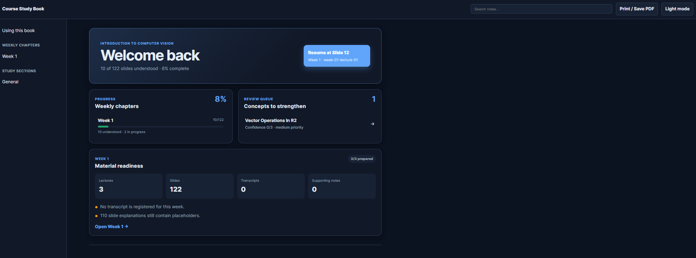
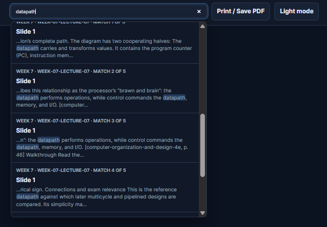
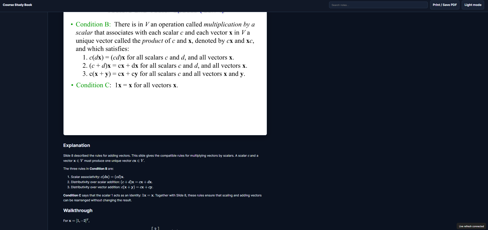
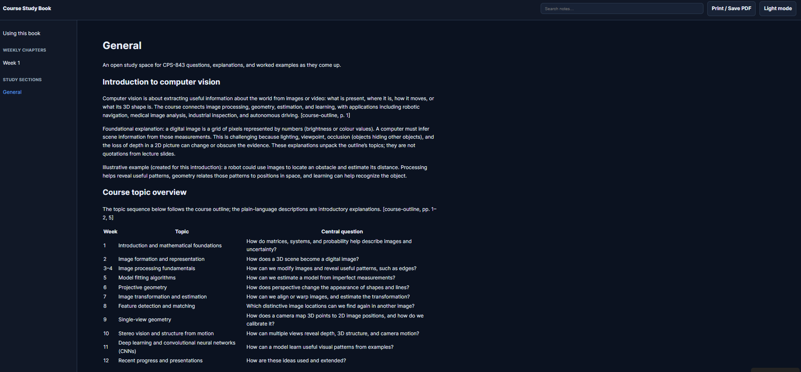

# Codex Course Tutor Template

This repository is a reusable template for an individual course repository. Use it to organize a course's materials and study it with an interactive, source-grounded tutor. Add lecture slides and supporting materials, then ask Codex to teach the course one slide at a time. As you study, Codex builds an illustrated set of notes containing each original slide followed by a detailed explanation.

The tutor is designed for technical and STEM courses. It explains material from first principles, answers follow-up questions, checks comprehension at concept boundaries, remembers weak topics, and uses past assessments to prioritize important skills without revealing questions during ordinary lessons.

## What it looks like

The local study book turns prepared course materials into a resumable workspace. Its dashboard shows weekly progress, material readiness, and concepts that need review.



The built-in search makes it easy to jump back to a concept, slide explanation, or source-grounded passage.



Each original slide is followed by a source-grounded explanation and walkthrough, so the resulting notes read like an illustrated course book rather than a slide summary.



Open study sections provide a place for broader questions, topic connections, and worked examples outside the weekly slide sequence.



## Requirements

- Node.js 18.18 through 24. Node 20, 22, or 24 LTS is recommended for new setups.
- npm.
- Codex CLI, IDE extension, or desktop app working in the repository.

No system PDF or OCR package is required. The project uses cross-platform JavaScript dependencies. Poppler or MiKTeX tools already installed on a machine may be used manually, but they are not required. The first page that needs OCR may download Tesseract's English language data; later OCR runs use its local cache.

## Create a course

1. Use this repository as the template for a course repository.
2. Install dependencies with `npm install`.
3. Run `npm run install:skill` to place the tracked tutor skill where Codex discovers repository skills.
4. Edit `course.yml` with the course code, title, term, and current week.
5. [Add course materials with the tutor](#let-the-tutor-organize-an-inbox), or [register them manually](#add-material-manually).
6. Run `npm run doctor`, followed by `npm run study:prepare -- --week 1`.
7. Start Codex from the repository and say: `Use $course-tutor to teach me week 1.`

If `.agents` is managed or read-only in your Codex environment, skip step 3. `AGENTS.md` tells Codex to load the tracked skill directly from `skills/course-tutor/SKILL.md`.

## Add course materials

### Let the tutor organize an inbox

Put one or many files in `materials/inbox/`, then ask:

```text
Use $course-tutor to import the materials in the inbox for Week 8. Infer what you can and ask me about anything unclear.
```

The tutor inspects filenames and representative content, detects registered duplicates, infers source types and weeks, moves resolved files to their final locations, updates `sources.yml`, and validates the workspace. Ambiguous files and duplicates remain in the inbox. The importer never overwrites an existing destination.

When an AI interface accepts direct attachments, you can instead attach the files and ask the tutor to import them. It first stages a copy in the inbox so the external originals remain untouched.

Private or copyrighted material defaults to `materials/local/` and is not tracked by Git. The tutor asks before making a materially uncertain classification or treating material as safe to version. Importing organizes and registers files; ask it to **import and prepare** if you also want slide images and extracted text generated immediately.

### Add material manually

You can always organize the files yourself. Use these locations as conventions; `sources.yml` is what formally registers a source.

```text
materials/
├── inbox/                  # ignored staging area for agent-assisted import
├── course/                 # course outline and small course-wide files
├── weeks/week-01/          # lecture PDFs, transcripts, homework, labs
└── local/                  # ignored: textbooks, recordings, past exams
```

Each `sources.yml` entry needs a stable `id`, `type`, `title`, and either a `path` or `url`. Weekly sources also use `week` and optionally `lecture`.

```yaml
- id: week-08-lecture-01
  type: lecture
  title: Week 8 Lecture 1
  path: materials/weeks/week-08/lecture-01.pdf
  week: 8
  lecture: 1
  tracked: true
```

Supported source types are `lecture`, `transcript`, `textbook`, `assessment`, `assignment`, `lab`, `homework`, `outline`, `notes`, and `web`. PDF and plain-text/Markdown files are processed locally. Web sources are consulted by the tutor when needed and must be cited.

Large, private, or copyrighted inputs belong under `materials/local/`. That directory is ignored by Git. Do not publish generated slide images or a built book containing course content without permission.

After adding an entry manually, run `npm run validate`, then prepare its week with `npm run study:prepare -- --week N`.

## Weekly workflow

1. Import new files through `materials/inbox/`, or place them in `materials/weeks/week-NN/` or `materials/local/` and register them in `sources.yml` manually.
2. Ask Codex `Use $course-tutor to prepare week N`, or run `npm run study:prepare -- --week N`.
3. Ask Codex `Use $course-tutor to teach me week N`.
4. Discuss each slide. Ask questions whenever an explanation is unclear.
5. The tutor revises that slide's permanent note and waits until you are ready to continue.
6. Later, say `Use $course-tutor to resume` or `Use $course-tutor to review my weak concepts`.

### Study progress

Your current lesson position, slide states, comprehension history, and review queue are stored in `study-data/progress.yml`. The course tutor updates this file automatically after each slide, allowing later sessions to resume from the same point and powering the course dashboard.

You normally do not need to edit this file manually. Keep it if you want your progress to persist, and commit it if you want that progress available on another device.

Other useful prompts:

- `Use $course-tutor to explain slide 14 again with a concrete example.`
- `Use $course-tutor to show how this equation is derived.`
- `Use $course-tutor to practise the 2025 midterm. I want to see solutions on request.`
- `Use $course-tutor to update the assessment map from all past exams.`

## Open study sections

Weekly lectures remain the main workflow. Open study sections use the same `course-tutor` skill. Invoke it explicitly when starting or resuming a section:

> Use $course-tutor to create a Midterm prep section using weeks 1–5 and the practice exam. Help me work through concepts and keep detailed notes as we talk.

> Use $course-tutor to resume my Midterm prep section.

> Use $course-tutor to start a Course connections section. Let me choose the topics and keep concise notes.

Codex creates authored Markdown under `notes/sections/<name>/index.md`, integrating useful explanations and worked examples after substantive exchanges. No week or PDF is required. Larger sections can have additional pages linked from their index. Personal-note blocks are protected.

Sections appear automatically under **Study sections** in the book, in search, and in Print / Save PDF. Run `npm run notes:dev` for live updates, or `npm run notes:build` for a static build. Saving Markdown drives updates; chat alone does not change the book.

Each section's purpose, references, current topic, and next step are saved in `study-data/sections.yml`, which starts with an empty versioned state. This keeps the weekly slide checkpoint intact. An unqualified resume returns to the active section; explicitly asking to resume weekly study switches back to the lecture. Notes and section state can be versioned alongside existing course notes.

## Read the course book

Run `npm run notes:dev` and open the local URL shown in the terminal. The book includes weekly chapters, slide images, explanations, math rendering, navigation, and local search.

Leave this command running while studying. It watches saved slide Markdown, the home and guide pages, study progress, course/source configuration, prepared images, and source manifests. After edits settle, it rebuilds the book and refreshes open browser tabs automatically, usually within a second plus build time. Your current page and approximate reading position are preserved. A small status indicator shows connection or build problems.

### Annotate slides with a mouse or stylus

While `npm run notes:dev` is running, every prepared slide has an **Annotate slide** button. The editor supports pressure-sensitive pen strokes, highlighting, whole-stroke erasing, lines, arrows, rectangles, ellipses, text, colours, fills, opacity, thickness, attached notes, selection, moving, resizing, undo/redo, zoom, and draft recovery. Use **Previous** and **Next**, or the left and right arrow keys when a control is not focused, to save changed annotations and move between slides without closing the editor; the matching slide notes update at the same time. Wacom and other styluses use browser Pointer Events; enable Windows Ink in the tablet driver when pressure is not detected.

Saving keeps three layers: the clean PDF render under `.study-cache/`, editable vector data under `notes/annotations/`, and the flattened PNG at the existing `notes/public/generated/` path. Markdown previews, the live book, static builds, printing, and the tutor therefore see the annotation without changing slide-note links. Re-preparing a PDF reapplies saved annotations. The editor refuses a stale save if its clean slide changed while the editor was open.

Annotation JSON is small, human-readable, and intended to be versioned. Clean slide bases and flattened PNGs remain generated files. The static preview command is read-only; annotation controls are available only through the local live server.

If an edit temporarily breaks the build (for example, an unfinished equation), the last successful book stays available. Fix and save the file to retry automatically. Newly added and deleted slide notes are included. Generated chapters and book output do not trigger rebuild loops. Stop the server with Ctrl+C. `npm run notes:preview` still serves a previously built book without watching.

Live refresh responds to files saved in this local repository. A conversation must actually update these Markdown files for the book to change; chat messages alone are not inputs to the book.

For a production build, run `npm run notes:build`. Generated HTML stays local under `.study-cache/book/` and is ignored by Git.

## What gets committed

Commit configuration, manifests, small materials you are permitted to version, slide-note Markdown, study progress, the tutor skill, scripts, tests, and documentation.

Do not commit `materials/local/`, `.study-cache/`, rendered slide images, dependencies, or generated HTML. The preparation command can recreate derived files from the original material.

## Troubleshooting

- **Wrong Node version:** run `node --version`; use a supported version and reinstall dependencies.
- **A source is missing:** verify its path in `sources.yml`. Missing local-only sources are warnings; missing tracked sources fail validation.
- **A PDF has no extracted text:** preparation automatically tries OCR. If OCR initialization or decoding fails, preparation records a page-level warning and continues with embedded text; the rendered page remains available for visual inspection. Use `--no-ocr` to skip OCR deliberately.
- **Notes did not change:** ensure Codex has permission to edit the repository and that you invoked the tutor skill.
- **Skill is not listed:** run `npm run install:skill` and restart Codex. The root `AGENTS.md` fallback still works.
- **Book is stale:** run `npm run notes:assemble` or restart `npm run notes:dev`.

For the software design, state files, data flow, and extension points, read [Technical architecture](docs/architecture.md).

For the slide-teaching model defaults and future update procedure, read [Course-tutor model policy](docs/model-policy.md).

## License

This project is licensed under the [MIT License](LICENSE).
